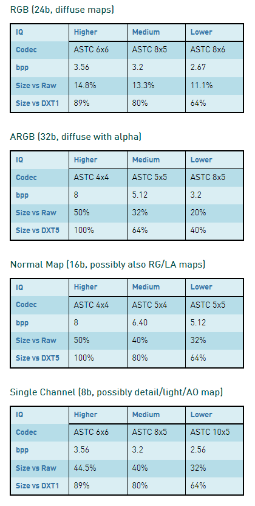
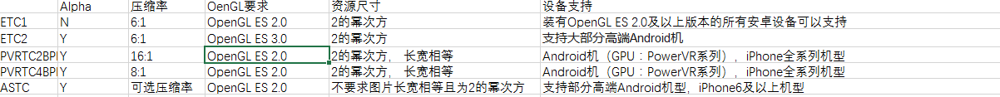

# astc纹理压缩工具
## astc简介
 >ES3.0出现后在2012年中产生的一种业界领先的纹理压缩格式，它的压缩分块从4x4到12x12最终可以压缩到每个像素占用1bit以下，压缩比例有多种可选。ASTC格式支持RGBA，且适用于2的幂次方长宽等比尺寸和无尺寸要求的NPOT（非2的幂次方）纹理。   
 以ASTC 4x4 block压缩格式为例，每个像素占用1字节，8bits。一张1024*1024大小的贴图压缩后的大小为1M。  
ASTC在压缩质量和容量上有很大的优势。  
文档中有详细的测试数据：

|block size|Bits Per Pixel|
|--|--|
|4x4|8.00|
|5x4|6.40|
|6x5|4.27|
|6x6|3.56|
|8x5|3.20|
|8x6|2.67|
|10x5|2.56|
|10x6|2.13|
|8x8|2.00|
|10x8|1.60|
|10x10|1.28|
|12x10|1.07|
|12x12|0.89|
### 对比

## 支持情况
### **ios**
苹果从A8处理器开始支持 ASTC，iPhone6及iPad mini 4以上iOS设备支持，2014年的iPhone 5s及iPad mini 3以前的设备不支持。
### **安卓**
主流压缩格式正在从ETC2转向ASTC。
>**经测试，微信的安卓都不支持astc，ios从se开始都支持astc**

### **其他说明**
所有支持OpenGL ES 3.1和部分支持OpenGL ES 3.0的GPU
* 微信的兼容性提示

---
#### **LayaAir引擎2.12版开始支持ASTC纹理,支持的格式如下面的表格所示：**

||||
|--|:--|--|
|1|ASTC_4x4|ASTC_4x4|
|2|ASTC_6x6|ASTCSRGB_6x6|
|3|ASTC_8x8|ASTCSRGB_8x8|
|4|ASTC_10x10|ASTCSRGB_10x10|
|5|ASTC_12x12|ASTCSRGB_12x12|

## etc

Android设备中一般使用ETC1压缩，一种有损的图像压缩方式。 
ETC1是OpenGL2.0支持的标准，压缩之后每个像素占4bit，压缩之后的格式为KTX或者PKM，前者支持存储多纹理，后者只支持单纹理。 
上面的图片压缩之后的大小为：1024 * 1024 * 4 bit = 0.5MB 
ETC1的缺点是不支持Alpha通道，不支持有透明度的图片压缩。 
ETC2解决了Alpha通道，但是它是OpenGL3.0标准，考虑到2.0设备的市场占有率，一般使用ETC1
ETC1压缩Alpha通道解决方案 

一种alpha贴图：是将alpha通道扩展到原图的下方，形成一个和原图一样大小的区域来表示原图中的alpha信息，对于PKM和KTX可以使用这种方式； 

另一种方法是将alpha信息写入KTX的meta信息中，在读入内存时，从meta中取出alpha信息，生成一张与原图一样大小的A8纹理，两种方式都会增加一倍的内存占用，所以经过扩展的ETC1每像素大约会占8bit的内存。

## PVR
iOS设备中采用的图像格式一般是PVR，也是一种有损的图像压缩方式。

PVR压缩分为两种，PVRTC2和PVRTC4。 
PVRTC4：Compressed format, 4 bits per pixel, ok image quality 
PVRTC2：Compressed format, 2 bits per pixel, poor image quality

常用的PVRTC4，压缩之后的大小为：1024 * 1024 * 4 bit = 0.5MB 
除了压缩内存，PVR可以直接被显卡读取，载入速度更快；缺点是PVR需要PowerVR芯片支持，目前iOS设备都能完美支持，Android支持尚少；此外，PVRTC4只支持方形贴图，非方形会被处理成方形，且长宽必须为2的幂。

### 参考文献：
* 工具  
[https://github.com/ARM-software/astc-encoder](https://github.com/ARM-software/astc-encoder)    
* astc  
[http://developer.nvidia.com/astc-texture-compression-for-game-assets](http://developer.nvidia.com/astc-texture-compression-for-game-assets)